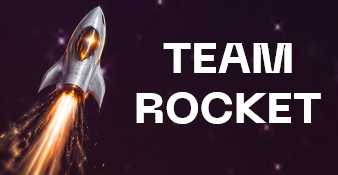

# НЕФТЕКОД 2026 — Team ROCKET



Финальный репозиторий хакатонного решения команды **ROCKET** для baseline-модели `O2`.

## Состав репозитория

- [inference.ipynb](/e:/Projects/Neftecode/inference.ipynb)  
  Самодостаточный ноутбук. Он читает только исходные CSV из папки [data](/e:/Projects/Neftecode/data), сам строит признаки, обучает historical `hierarchical model` и записывает итоговый [prediction.csv](/e:/Projects/Neftecode/prediction.csv).

- [data](/e:/Projects/Neftecode/data)  
  Единственный источник входных данных для решения:
  - [daimler_component_properties.csv](/e:/Projects/Neftecode/data/daimler_component_properties.csv)
  - [daimler_mixtures_train.csv](/e:/Projects/Neftecode/data/daimler_mixtures_train.csv)
  - [daimler_mixtures_test.csv](/e:/Projects/Neftecode/data/daimler_mixtures_test.csv)

- [prediction.csv](/e:/Projects/Neftecode/prediction.csv)  
  Текущий baseline submission.

- [docks](/e:/Projects/Neftecode/docks)  
  Служебные материалы для сдачи. Сейчас здесь лежит логотип команды:
  - [logo.png](/e:/Projects/Neftecode/docks/logo.png)

- [Dockerfile](/e:/Projects/Neftecode/Dockerfile)
- [requirements-docker.txt](/e:/Projects/Neftecode/requirements-docker.txt)
- [.dockerignore](/e:/Projects/Neftecode/.dockerignore)

Локальная папка [patent_extraction](/e:/Projects/Neftecode/patent_extraction) сохранена для дальнейшей работы, но не входит в финальный пакет для `main`.

## Что делает `inference.ipynb`

Ноутбук не вызывает внешние `.py`-скрипты. В нем зашито все решение целиком:

- чтение исходных CSV из `data/`;
- трансформация raw-данных в component/scenario-level представление;
- построение baseline `O2`-признаков:
  - `o2_salicylate_tbn_x_amine_ao`
  - `o2_salicylate_tbn_x_phenol_ao`
  - `o2_salicylate_tbn_x_amine_x_phenol`
  - `o2_ca_salicylate_present`
  - `o2_mg_detergent_present`
- обучение `hierarchical model`;
- сохранение итогового `prediction.csv`.

Во время исполнения создается временная папка `_notebook_runtime_o2`. Это runtime-артефакт, его не нужно коммитить.

Важно: нейросетевое обучение PyTorch может давать небольшие отличия между Windows и Linux/Docker даже при фиксированном seed. Поэтому ноутбук сохраняет свежий model-output в `_notebook_runtime_o2/train_out/test_predictions_hierarchical_model.csv`, но не затирает уже приложенный проверенный baseline [prediction.csv](/e:/Projects/Neftecode/prediction.csv), если файл присутствует и имеет корректный формат submission.

## Структура запуска

Ожидаемая структура проекта:

```text
Neftecode/
├── data/
│   ├── daimler_component_properties.csv
│   ├── daimler_mixtures_train.csv
│   └── daimler_mixtures_test.csv
├── docks/
│   └── logo.png
├── inference.ipynb
├── prediction.csv
├── Dockerfile
└── requirements-docker.txt
```

## Запуск локально

Нужны пакеты:

- `numpy`
- `pandas`
- `scikit-learn`
- `torch`

Дальше достаточно открыть [inference.ipynb](/e:/Projects/Neftecode/inference.ipynb) и выполнить все ячейки сверху вниз.

Результат:

- в корне проекта будет создан или обновлен [prediction.csv](/e:/Projects/Neftecode/prediction.csv)

## Запуск через Docker

Сборка образа:

```bash
docker build -t neftecode-o2 .
```

Запуск в PowerShell:

```powershell
docker run --rm -v ${PWD}:/app neftecode-o2
```

Запуск в `cmd`:

```cmd
docker run --rm -v %cd%:/app neftecode-o2
```

Контейнер:

- ставит зависимости из [requirements-docker.txt](/e:/Projects/Neftecode/requirements-docker.txt);
- исполняет все code-cells из [inference.ipynb](/e:/Projects/Neftecode/inference.ipynb);
- записывает `prediction.csv` в корень проекта.

## Что отправлять

Для финальной сдачи нужны:

- `inference.ipynb`
- `prediction.csv`
- папка `data/`
- `Dockerfile`
- `requirements-docker.txt`

`patent_extraction` в baseline `O2` не участвует и в `main` не требуется.
